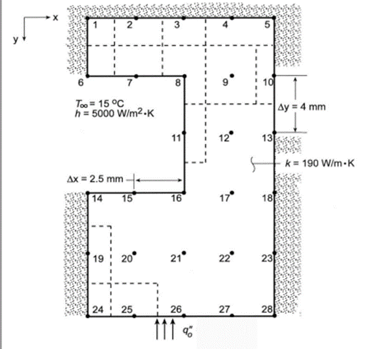
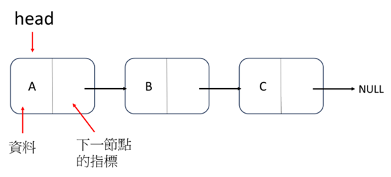
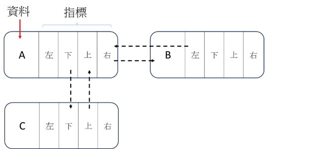
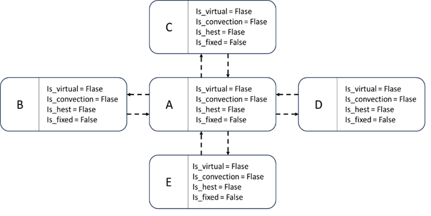
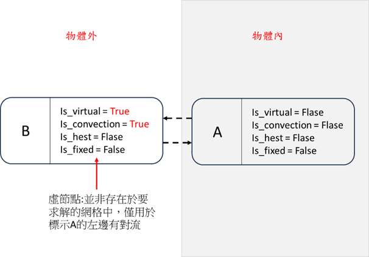
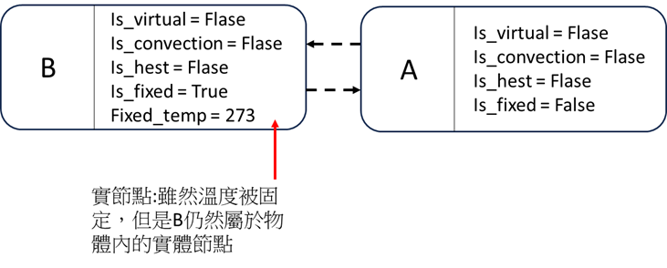
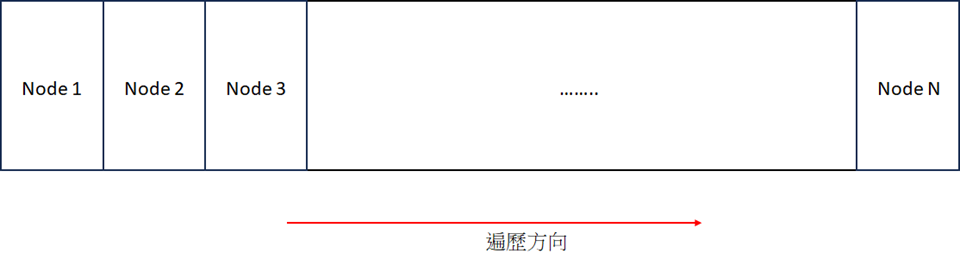
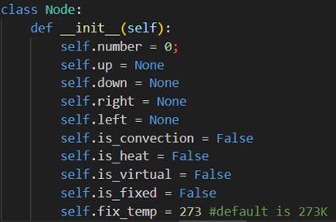
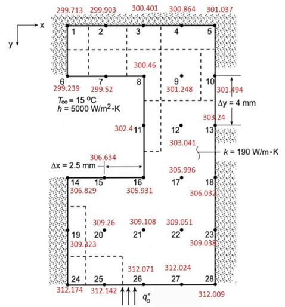

# Thermal Analysis of IBM Multi-Chip Cold Plate using Finite Volume Method (FVM)
This project implements a **2D Finite Volume Method (FVM)** to analyze conduction and convection heat transfer in a cold plate with 28 discrete points. FVM is a computational technique that decomposes a complex system into smaller control volumes (nodes), each governed by equations predicting its behavior. By assembling individual volume behaviors, FVM simulates the thermal response of the entire system under various physical conditions. This method is widely used in engineering and physics for its ability to accurately predict the response of structures and materials to forces, heat, and other external factors.
<td style="text-align: center; vertical-align: middle;">
  

     
  

</td>

## Features 
### Industrial Applications
- Modular 2D FVM framework suitable for analyzing multi-chip cold plates and other thermal management systems.  
- Extensible to microelectronics cooling, semiconductor packaging, and complex conduction-convection scenarios.  
- Provides a lightweight simulation tool for rapid prototyping and design verification in engineering environments.

## Objective
The goal of this project is to create a general, reusable **Python** code for thermal analysis using a 2D Linked List to solve conduction and convection problems. Users can simply set node positions and conditions to solve similar heat transfer problems across different materials and boundary conditions, enabling a lightweight tool for engineering applications.

## Data Structure Choice: 2D Linked List
- **Why 2D Linked List**: The 2D Linked List intuitively represents the computational grid, simplifying coding and debugging by directly mapping physical geometry to the grid. Its dynamic nature allows flexible modification of the mesh, facilitating different material properties and boundary conditions.  
- **Node Structure**: Each node contains:
  - `number`: node ID
  - `up, down, left, right`: neighbor pointers
  - `is_convection`: True if the node has convection
  - `is_heat`: True if the node is a heat source
  - `is_virtual`: True for virtual nodes representing heat sources or convection
  - `is_fixed` and `fixed_temp`: fix temperature if needed
- **Grid Connectivity**: Neighbor connections handle normal, convection, heat source, and fixed temperature conditions, ensuring correct assembly of the FVM equations.
<table>
  <tr>
    <td>
       
      
<b>1D Linked List</b>

    </td>
    <td>
       
      
<b>2D Linked List</b>>

    </td>
  </tr>
</table>

## FVM Implementation

- **Node Attributes:** Each node includes identifiers, directional neighbor pointers (up, down, left, right), and flags for convection, heat source, virtual node, or fixed temperature.
 <table>
  <tr>
    <td>
       
      
<b>basic connection</b>

    </td>
    <td>
       
      
<b>convection</b>>

    </td>
  </tr>
</table>

 <table>
  <tr>
    <td>
       
      
<b>heat source</b>

    </td>
    <td>
       
      
<b>fixed temperature</b>>

    </td>
  </tr>
</table>
    
- **FVM Formulation:**
  - Fourier’s Law: `q_x = K * A * ΔT / ΔX`  
  - Newton’s Cooling Law: `q = K * A * (T_surface - T_fluid)`
    
- **Python Implementation:** Nodes are represented by a `Node` class, and the solver iterates over an array of node pointers for efficient computation.
  <td style="text-align: center; vertical-align: middle;">
  

     
  

</td>

## Challenges & Solutions
  <td style="text-align: center; vertical-align: middle;">
  

     
  

</td>
- **Challenge**: Handling non-rectangular grids with 2D Linked List is difficult due to its inherent rectangular structure.  
- **Solution**:  
  - Hybrid data structures combining Linked List, arrays, and tree structures for irregular shapes.  
  - Enhanced node class storing geometry information for accurate representation.  
  - Dynamic mesh refinement algorithms for local resolution adjustment.

## Advantages
- Easy to implement and lightweight, suitable for simple 2D problems without large software installation.  
- User-friendly interface with Python, enabling quick setup and execution.  
- Can be extended to larger-scale thermal simulations by increasing mesh density and defining boundary conditions.

## Limitations
- Current implementation only supports rectangular grids and lacks dynamic mesh refinement.  
- Not optimized for high-performance computing, but sufficient for educational and prototyping purposes.

## Summary
This project combines computer science and mechanical engineering knowledge to provide a simple, flexible, and reusable thermal analysis tool. While limited to rectangular grids, the approach demonstrates fundamental engineering problem-solving skills and lays the groundwork for future extensions to complex thermal simulations in industrial applications.
